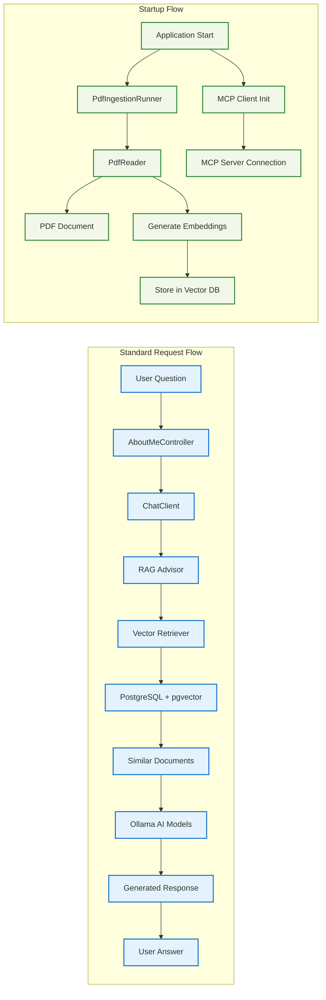
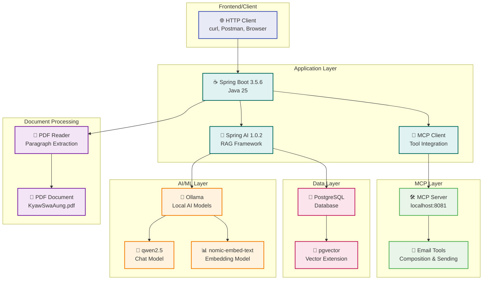

# System Architecture Diagram

## About Me - AI-Powered Personal Information Assistant

This document provides detailed system architecture diagrams and component interactions for the AI-powered personal information assistant with MCP (Model Context Protocol) integration.

## Component Interaction Diagram

## Technology Stack Overview

