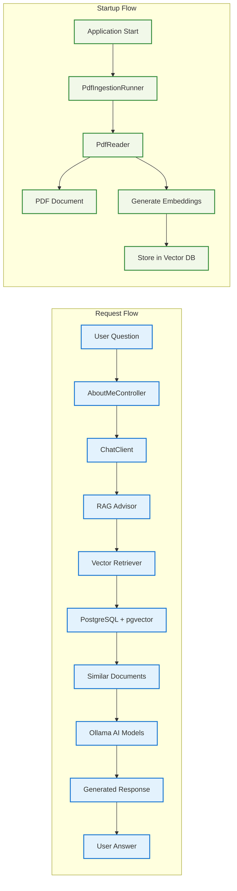
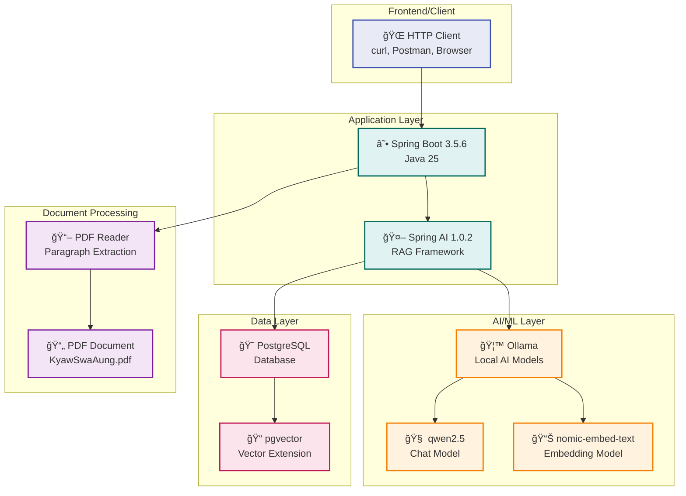

# System Architecture Diagram

## About Me - AI-Powered Personal Information Assistant

## Component Interaction Diagram

```mermaid
graph LR
    subgraph "Request Flow"
        A[User Question] --> B[AboutMeController]
        B --> C[ChatClient]
        C --> D[RAG Advisor]
        D --> E[Vector Retriever]
        E --> F[PostgreSQL + pgvector]
        F --> G[Similar Documents]
        G --> H[Ollama AI Models]
        H --> I[Generated Response]
        I --> J[User Answer]
    end

    subgraph "Startup Flow"
        K[Application Start] --> L[PdfIngestionRunner]
        L --> M[PdfReader]
        M --> N[PDF Document]
        M --> O[Generate Embeddings]
        O --> P[Store in Vector DB]
    end

    classDef request fill:#e3f2fd,stroke:#1976d2,stroke-width:2px
    classDef startup fill:#f1f8e9,stroke:#388e3c,stroke-width:2px
    
    class A,B,C,D,E,F,G,H,I,J request
    class K,L,M,N,O,P startup
```

## Technology Stack Overview

```mermaid
graph TB
    subgraph "Frontend/Client"
        Client[🌠HTTP Client<br/>curl, Postman, Browser]
    end

    subgraph "Application Layer"
        SpringBoot[☕ Spring Boot 3.5.6<br/>Java 25]
        SpringAI[🤖 Spring AI 1.0.2<br/>RAG Framework]
    end

    subgraph "AI/ML Layer"
        Ollama[🦙 Ollama<br/>Local AI Models]
        Qwen[🧠 qwen2.5<br/>Chat Model]
        Embed[📊 nomic-embed-text<br/>Embedding Model]
    end

    subgraph "Data Layer"
        PostgreSQL[😠PostgreSQL<br/>Database]
        PgVector[📠pgvector<br/>Vector Extension]
    end

    subgraph "Document Processing"
        PDF[📄 PDF Document<br/>KyawSwaAung.pdf]
        PDFReader[📖 PDF Reader<br/>Paragraph Extraction]
    end

    Client --> SpringBoot
    SpringBoot --> SpringAI
    SpringAI --> Ollama
    Ollama --> Qwen
    Ollama --> Embed
    SpringAI --> PostgreSQL
    PostgreSQL --> PgVector
    SpringBoot --> PDFReader
    PDFReader --> PDF

    classDef frontend fill:#e8eaf6,stroke:#3f51b5,stroke-width:2px
    classDef app fill:#e0f2f1,stroke:#00695c,stroke-width:2px
    classDef ai fill:#fff3e0,stroke:#f57c00,stroke-width:2px
    classDef data fill:#fce4ec,stroke:#c2185b,stroke-width:2px
    classDef doc fill:#f3e5f5,stroke:#7b1fa2,stroke-width:2px

    class Client frontend
    class SpringBoot,SpringAI app
    class Ollama,Qwen,Embed ai
    class PostgreSQL,PgVector data
    class PDF,PDFReader doc
```
