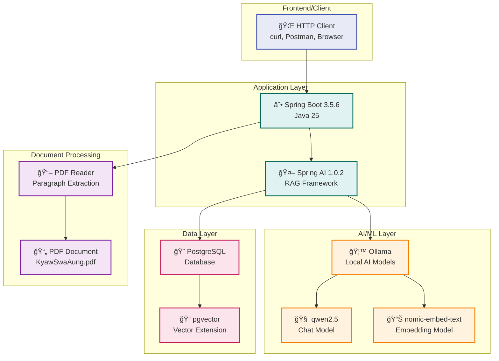

# System Architecture Diagram

## About Me - AI-Powered Personal Information Assistant

```mermaid
graph TB
    %% External Systems
    subgraph "External Systems"
        PDF[📄 KyawSwaAung.pdf]
        Ollama[🤖 Ollama AI Models<br/>- qwen2.5 (Chat)<br/>- nomic-embed-text (Embeddings)]
    end

    %% Client Layer
    subgraph "Client Layer"
        User[👤 User]
        API[🌐 REST API Client<br/>curl/browser]
    end

    %% Application Layer
    subgraph "Spring Boot Application"
        subgraph "Controllers"
            Controller[🎮 AboutMeController<br/>/me?question={q}<br/>/verify-pdf]
        end
        
        subgraph "Services"
            Service[⚙️ AboutMeService<br/>PDF Verification]
            PdfReader[📖 PdfReader<br/>PDF Processing]
        end
        
        subgraph "AI Components"
            ChatClient[💬 ChatClient<br/>RAG-enabled]
            RAG[🔍 Retrieval-Augmented<br/>Generation Advisor]
            VectorRetriever[🎯 Vector Store<br/>Document Retriever]
        end
        
        subgraph "Runners"
            IngestionRunner[🚀 PdfIngestionRunner<br/>CommandLineRunner]
        end
    end

    %% Data Layer
    subgraph "Data Layer"
        subgraph "PostgreSQL Database"
            PgVector[🗄️ pgvector Extension<br/>vector_store table<br/>768 dimensions]
        end
    end

    %% Flow Connections
    User --> API
    API --> Controller
    
    Controller --> ChatClient
    Controller --> Service
    
    ChatClient --> RAG
    RAG --> VectorRetriever
    VectorRetriever --> PgVector
    
    Service --> PgVector
    
    %% Startup Flow
    IngestionRunner --> PdfReader
    PdfReader --> PDF
    PdfReader --> PgVector
    
    %% AI Model Connections
    ChatClient --> Ollama
    VectorRetriever --> Ollama
    
    %% Styling
    classDef external fill:#e1f5fe,stroke:#01579b,stroke-width:2px
    classDef client fill:#f3e5f5,stroke:#4a148c,stroke-width:2px
    classDef controller fill:#e8f5e8,stroke:#1b5e20,stroke-width:2px
    classDef service fill:#fff3e0,stroke:#e65100,stroke-width:2px
    classDef ai fill:#fce4ec,stroke:#880e4f,stroke-width:2px
    classDef data fill:#f1f8e9,stroke:#33691e,stroke-width:2px
    
    class PDF,Ollama external
    class User,API client
    class Controller controller
    class Service,PdfReader,IngestionRunner service
    class ChatClient,RAG,VectorRetriever ai
    class PgVector data
```

## Data Flow Diagram


## Component Interaction Diagram


## Technology Stack Overview


